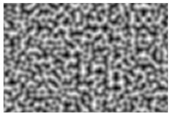
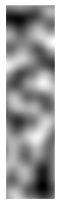

# perlin-noise-python-numpy
A python realization of [Perlin noise](https://en.wikipedia.org/wiki/Perlin_noise) generator.

## Examples of visualization

### Image of size 200x200 filled with noise generated by 20x20 vectors grid
```python
img = generate_2D_perlin_noise(200, 20)
plt.imshow(img, cmap=cm.gray)
```


### The same with 8x8 vectors grid
```python
img = generate_2D_perlin_noise(200, 8)
plt.imshow(img, cmap=cm.gray)
```


### And with 4x4 vectors grid
```python
img = generate_2D_perlin_noise(200, 4)
plt.imshow(img, cmap=cm.gray)
```


### Image of size 200x300 with 10x10 vectors grid
```python
img = generate_2D_perlin_noise((200,300), 10)
plt.imshow(img, cmap=cm.gray)
```


### Image of size 200x50 with 25x25 vectors grid
```python
img = generate_2D_perlin_noise((200,50), 25)
plt.imshow(img, cmap=cm.gray)
```


### The sky is made of four images generated with grids of different size
```python
from matplotlib.colors import LinearSegmentedColormap

# generate "sky"
img0 = generate_2D_perlin_noise(400, 80)
img1 = generate_2D_perlin_noise(400, 40)
img2 = generate_2D_perlin_noise(400, 20)
img3 = generate_2D_perlin_noise(400, 10)

img = (img0 + img1 + img2 + img3) / 4
cmap = LinearSegmentedColormap.from_list('sky',
                                        [(0, '#0572D1'),
                                         (0.75, '#E5E8EF'),
                                         (1, '#FCFCFC')])
img = cm.ScalarMappable(cmap=cmap).to_rgba(img)
plt.imshow(img)
```


